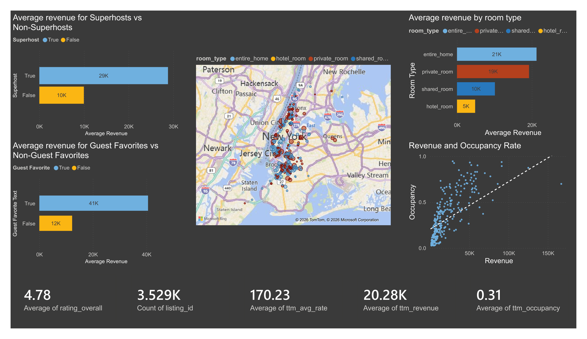

# NYC AirBNB Data Analysis

This project analyzes New York City Airbnb listings using SQL, Python, and Power BI to identify the strongest drivers of revenue and occupancy. I cleaned a messy multi-table dataset, built exploratory analyses in MySQL, and created an interactive dashboard to evaluate pricing, seasonality, listing type, and reputation effects (Superhost and Guest Favorite).

## Tech Stack
- **Python** for preprocessing and CSV repair
- **MySQL** for data cleaning and exploratory analysis
- **Power BI** for dashboarding and DAX measures
- **GitHub** for version control and project presentation
## Methodology

I sourced this dataset from [Airroi](https://www.airroi.com/data-portal/markets/new-york-united-states), 
originally discovered via Reddit. It includes Listings, Past and Future Calendar Rates, and Review Data. Host Data was not yet available at the time of analysis, though it is listed as coming soon.

I intentionally selected a messy dataset to practice real world data cleaning. The primary challenge was column misalignment in the Listings Data; each row was expected to have 75 columns, but some had up to 125. The root cause was unescaped commas within free-text fields like description and amenities, which were being parsed as column delimiters in the CSV.

To address this, I wrote a Python script to identify and recombine the fragmented columns. While this resolved the description field, other text columns with embedded commas continued to cause import errors in MySQL Workbench. After evaluating my options, I made the decision to drop the problematic columns, name, description, and amenities, as they fell outside the scope of my analysis. Amenities presented an additional challenge in that they were stored as lists, which was a bit out of my realm.

To complete the import without errors, I created a staging table in MySQL Workbench before loading the Listings Data into its final table.

For data cleaning, I standardized column data types across all tables, replaced blank numeric fields with NULL, converted boolean fields to 0/1 encoding, and reformatted check-in and check-out times into 24-hour format after stripping extraneous characters.

With a clean dataset in place, I moved on to exploratory analysis, covered in the next section.
## SQL Exploratory Analysis
### Average nightly rate
The average listing rate for this dataset was **$170.23**.
### Superhosts vs Regular Hosts
Superhosts showed **better metrics** across **ALL** measured metrics.

- Higher average revenue (231%)
- Higher occupancy (128%)
- Higher ratings (3%)
- More reviews (63%)

This suggests that being a **Superhost** is associated with both better guest satisfaction and business performance.

### Guest Favorite vs Regular Hosts

Similar was found with Guest Favorites, where they outperformed Regular Hosts in every measured metric.

- Higher average revenue (189%)
- Higher occupancy (116%)
- Higher ratings (2%)
- More reviews (36%) 

### Most Popular Types of Rental

Entire homes generated the highest revenue.

- Represented the majority of listings and the strongest revenue performance.

Private rooms achieved the highest occupancy rate and ratings.

- Had the best occupancy, ratings, and review counts, indicating strong demand and guest satisfaction despite lower revenue.

This highlights a trade-off between revenue generation and occupancy/guest engagement.

### Pricing Analysis

Excluding outliers, listings priced **$100-200** per night had the highest occupancy and largest number of listings.

| Price Bucket | Observation |
| -- | -- |
| $100-200 | Highest occupancy among non-outlier buckets and the largest listing count. |
| $200-300 | Strong revenue performance with a meaningful sample size. |
| $300-400 | Highest average revenue among non-outlier buckets but based on a much smaller sample (11 listings). |
| High-priced bucekts | Produced exceptional averages, but each contained only 1 listing and should not drive broad conclusions. |

There appears to be a sweet spot with pricing where occupancy remains strong while revenue remains desirable in the **$100-300** per night range.

### Seasonality

There was a clear trend when it came to revenue and time of year.

| Month | Total Revenue |
| -- | -- |
| May | $1,185,698 |
| June | $1,158,820 |
| April | $1,083,860 |
| July | $1,081,627 |
| September | $878,971 |
| October | $802,616 |
| August | $797,194 |
| December | $594,563 |
| November | $570,215 |
| March | $297,040 |
| January | $234,422 |
| February | $200,468 |

The strongest months in terms of revenue were **May, June, April, and July,** indicating that **spring and early summer** are peak revenue periods in this market.

### Length of Stay

Average revenue **declined** as average length of stay increased.

| Length of Stay | Avg Revenue | Listings |
| -- | -- | -- |
| 1-5 | $35,800.51 | 68 |
| 6-10 | $19,558.00 | 48 |
| 16-23 | $19,027.31 | 61 |
| 24+ | $15,029.32 | 63 |
| 11-15 | $10,043.25 | 60 |

This suggests an **inverse relationship** between length of stay and revenue. This may be because of discounts given for long term rentals.

### What has the strongest correlation with revenue?

| Variable | Correlation |
| -- | -- |
| Nightly rate | 0.633 |
| Occupancy | 0.617 |
| Bedrooms | 0.351 |
| Number of reviews | 0.296 |
| Guest capacity | 0.289 |
| Overall rating | 0.118 |
| Average length of stay | -0.183 |

**Nightly rate and occupancy are the strongest drivers of revenue** in this market. Number of bedrooms, capacity, and review count show a moderately positive relationship, wihle ratings have a weak relationship, maybe due to listings having high ratings in general. Longer stays are associated with slightly lower revenue.
## Visualizations
I used Power BI to create an interactive, multi-page dashboard for this dataset.

To support the analysis, I created DAX measures for Superhost status and Guest 
Favorite status, along with individual page-level summary metrics. I also 
engineered a rating bucket column to enable grouped rating analysis across listings. 
To improve chart readability, I adjusted the x-axis limits on the Revenue vs. 
Occupancy scatter plot to exclude an outlier that was skewing the visual scale.

### Summary

- High-level KPIs across all listings (average revenue: $20.28K, occupancy: 31%, nightly rate: $170.23, overall rating: 4.78). 

- Compares average revenue by Superhost status, Guest Favorite status, and room type, with a geographic map of listings and a revenue-occupancy scatter plot.

### Pricing Analysis
- Examines how price buckets affect occupancy and revenue. Listings priced $100–200 achieved the highest occupancy rates among statistically meaningful groups. 

- Includes a breakdown of average rate and revenue by room type.

- Price buckets with fewer than 5 listings were excluded to ensure findings reflect statistically meaningful sample sizes.

### Guest Experience Analysis
- Explores what drives overall guest ratings. 

- Contrary to expectations, location and value had the weakest correlation with overall rating, while accuracy, cleanliness, and communication were the strongest predictors. 

- Average overall rating across all listings was 4.78 across 45K reviews.

### Seasonality & Future Performance
- Compares past and future average revenue and occupancy by month and quarter. 

- Past data shows a Q3 peak consistent with summer travel demand. 

- Future bookings show lower Q3/Q4 figures, likely reflecting limited advance booking activity rather than reduced demand.

## Final Analysis

### Core Drivers of Performance
- **Pricing Stategy:** rate and occupancy have the largest correlations with revenue.
- **Superhost/Guest Favorite:** revenue and occupancy double with both of these statuses.
- **Seasonality:** having a listing ready in the Spring/ early Summer has the best revenue and occupancy.

### Three Pillars of a High Performing Listing
- **Pricing:** $100-300 is the optimal performing rate for listings. Going lower hinders your ability to grow revenue, higher hurts occupancy.
- **Occupancy:** one of the strongest correlations with revenue, keeping this high is the key to a high performing listing.
- **Reputation:** getting Superhost/Guest Favorite status should be an immediate goal for every listing with how much it boosts all statistics.

### Market Structure Insight
- While ratings are important, availability and pricing have a much larger impact. Overall ratings had a low correlation with revenue, so it is better to focus on other aspects that will have a larger return on investment.
- Demand is highly seasonal, meaning timing is almost as important as pricing.

### Strategic Recommendations
- **Max revenue:** target the $200-300 price range, focus on entire home listings, aim for Superhost/Guest Favorite status, and optimize for Q2(Spring/early Summer).
- **Max occupancy:** target the $100-200 price range, aim for Superhost/Guest Favorite status, proritize private rooms.
- **Balanced approach:** price your listing dynamically by season to keep occupancy up in slower months, aim for Superhost/Guest Favorite status, avoid listings being available for long stays.

### Conclusion
Overall, this dataset shows that performance in this market is mostly driven by pricing stategy and demand timing, with reputation(Superhost/Guest Favorite) having a large impact on performance, while traditional ratings having less of an impact.
## Acknowledgements

Full credit for this dataset goes to [Airroi](airroi.com) and [AirBNB](https://www.airbnb.com/).

Data set source: https://www.airroi.com/data-portal/markets/new-york-united-states

